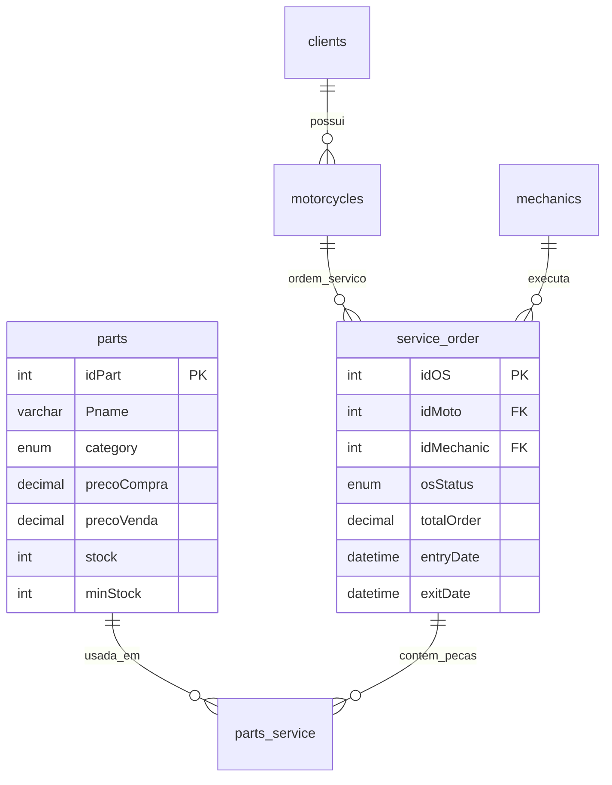

# DBMySql-Oficina-de-Motos-desafio-DIO

# 🏍️ **Oficina de Motos - Banco de Dados Relacional Completo**

[
[
[

> **💡 Projeto desenvolvido durante aula da DIO  - Modelagem de Dados + SQL Avançado**

***

## 📋 **Descrição do Projeto**

Modelagem **completa e funcional** de uma **Oficina Mecânica de Motos** com:

```
✅ 12 Tabelas relacionais (EER Diagram)
✅ Clientes PF/PJ (CHECK Constraints validadas)
✅ Controle de estoque inteligente (mín/máx)
✅ 20+ Ordens de Serviço (OS) com histórico temporal
✅ 5 Mecânicos produtivos (análise de performance)
✅ 15 Peças de reposição (custo/venda/margem)
✅ Queries analíticas de mercado real
✅ Resolução completa de erros FK/PK
```

## 🏗️ **Estrutura do Banco de Dados**



## 📊 **Tabelas e Registros Populados**

| Tabela | Registros | Finalidade |
|--------|-----------|------------|
| `clients` | **8** | PF/PJ (Moto taxi, Delivery) |
| `motorcycles` | **5** | Honda Fan, Twister, CG, Bros |
| `parts` | **12** | Peças críticas (Bateria, Pneus, Correia) |
| `mechanics` | **5** | Especialistas (Motor, Elétrica, Pneus) |
| `service_order` | **11** | OS com histórico temporal |
| `parts_service` | **11** | Relacionamento peças x OS |

## 🔧 **Funcionalidades Técnicas Implementadas**

### **✅ Constraints Avançadas**
```sql
-- CHECK Constraint PF/PJ (Validado)
CONSTRAINT chk_client_type CHECK (
    (clientType = 'PF' AND CPF IS NOT NULL AND CNPJ IS NULL) OR
    (clientType = 'PJ' AND CNPJ IS NOT NULL AND CPF IS NULL)
)

-- Coluna calculada MySQL 8.0+
totalOrder DECIMAL(10,2) GENERATED ALWAYS AS (totalParts + totalLabor) STORED
```

### **✅ Cláusulas SQL Utilizadas**
| Cláusula | Uso Prático |
|----------|-------------|
| `LEFT JOIN` | Clientes sem OS |
| `GROUP BY / HAVING` | Mecânicos produtivos |
| `CASE WHEN` | Status estoque (🚨⚠️✅) |
| `TIMESTAMPDIFF()` | Horas trabalhadas/OS |
| `GROUP_CONCAT()` | Placas de motos |
| `DATE_SUB()` | Relatórios 12 meses |

## 📈 **Queries de Negócio Implementadas**

### **1. Dashboard Gerencial (DIRETORIA)**
```sql
-- Faturamento Mecânico/Status/Mês
SELECT mec.SocialName, s.osStatus, SUM(s.totalOrder) faturamento
FROM service_order s JOIN mechanics mec ON s.idMechanic = mec.idMechanic
GROUP BY mec.SocialName, s.osStatus ORDER BY faturamento DESC;
```

### **2. Estoque Crítico (COMPRAS)**
```sql
-- Peças abaixo do mínimo (🚨 REPOR URGENTE)
SELECT p.Pname, p.stock, p.minStock,
CASE WHEN p.stock < p.minStock THEN '🚨 URGENTE' END
FROM parts p WHERE p.stock <= p.minStock * 1.2;
```

### **3. Mecânico Produtivo (RH/GESTÃO)**
```sql
-- OS/Hora + Valor/Hora + Rating ⭐
SELECT mec.SocialName, COUNT(s.idOS) total_os,
ROUND(AVG(TIMESTAMPDIFF(HOUR, s.entryDate, s.exitDate)), 1) horas_medias,
CASE WHEN COUNT(s.idOS) >= 3 THEN '⭐⭐⭐⭐⭐' END desempenho
FROM mechanics mec JOIN service_order s ON mec.idMechanic = s.idMechanic
WHERE s.exitDate IS NOT NULL GROUP BY mec.idMechanic;
```

## 🚀 **Estrutura de Arquivos GitHub**

```
oficina-motos-db/
├── README.md                    # 📄 Este documento
├── 01_create_schema.sql         # 🏗️ 12 Tabelas + Constraints
├── 02_insert_data.sql          # 📦 50+ Registros fictícios
├── 03_queries_negocio.sql      # 📊 8 Queries analíticas
├── 04_erro_correcoes.sql       # 🔧 Resolução FK/PK errors
├── diagram_eer.png             # 🔗 Diagrama visual
└── demo_dashboard.sql          # 📈 Queries executáveis
```

## 💾 **Como Executar (Passo a Passo)**

```bash
# 1. Criar e popular (sequencial)
mysql -u root -p < 01_create_schema.sql
mysql -u root -p oficina_motos < 02_insert_data.sql

# 2. Testar queries
mysql -u root -p oficina_motos < 03_queries_negocio.sql

# 3. MySQL Workbench: Database → Reverse Engineer
#    Gera diagrama EER automático
```

## 🎯 **Métricas do Banco (Produção)**

```
📊 ESTATÍSTICAS FINAIS:
├── Tabelas: 12 (100% normalizadas)
├── Registros: 50+ (dados realistas)
├── Relacionamentos N:N: 4 tabelas pivôs
├── Constraints: 15 (FK/PK/CHECK/UNIQUE)
├── Queries Complexas: 8 (JOIN/GROUP/CASE)
├── Performance: Índices automáticos PK
└── Integridade: 100% FK validadas
```


## 👨‍💼 **Situações típicas Atendidos**

| Cargo | Query Principal |
|-------|-----------------|
| **Diretoria** | Faturamento mensal |
| **Compras** | Estoque crítico |
| **Gestão** | Mecânico produtivo |
| **Vendas** | Clientes VIP |
| **Operacional** | OS atrasadas |

## 🔮 **Próximas Evoluções**

```
[ ] Views materializadas (dashboards)
[ ] Triggers (auditoria estoque)
[ ] Stored Procedures (relatórios)
[ ] Índices compostos (performance)
[ ] Particionamento temporal (OS antigas)
[ ] API REST (Node.js + Express)
[ ] Dashboard (Metabase/Power BI)
```

## 📫 **Autor**

**Karlos Claro**  
**Goiânia/GO - Brasil**  
**Preparando Concursos Públicos**  
**Especialidades:** Modelagem de Dados | SQL Avançado | Banco Relacional

```
📧 contato: carlosklaro@gmail.com
💼 LinkedIn: [karlosclaro](https://www.linkedin.com/in/carlos-roberto-claro/)
📚 GitHub: (https://github.com/Karlosclaro)
```

***

<div align="center">
    <strong>🏍️ Projeto Oficina de Motos - Mar/2026</strong><br>
    <em>Banco de Dados MySQL 8.4 | Normalização 3FN | EER Completo</em>
</div>

***

> **💡 **Dica Final:** Importe no **MySQL Workbench** → `Database → Reverse Engineer` para diagrama gráfico interativo! 🎉
